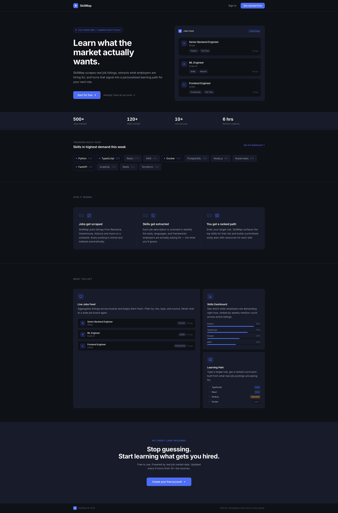
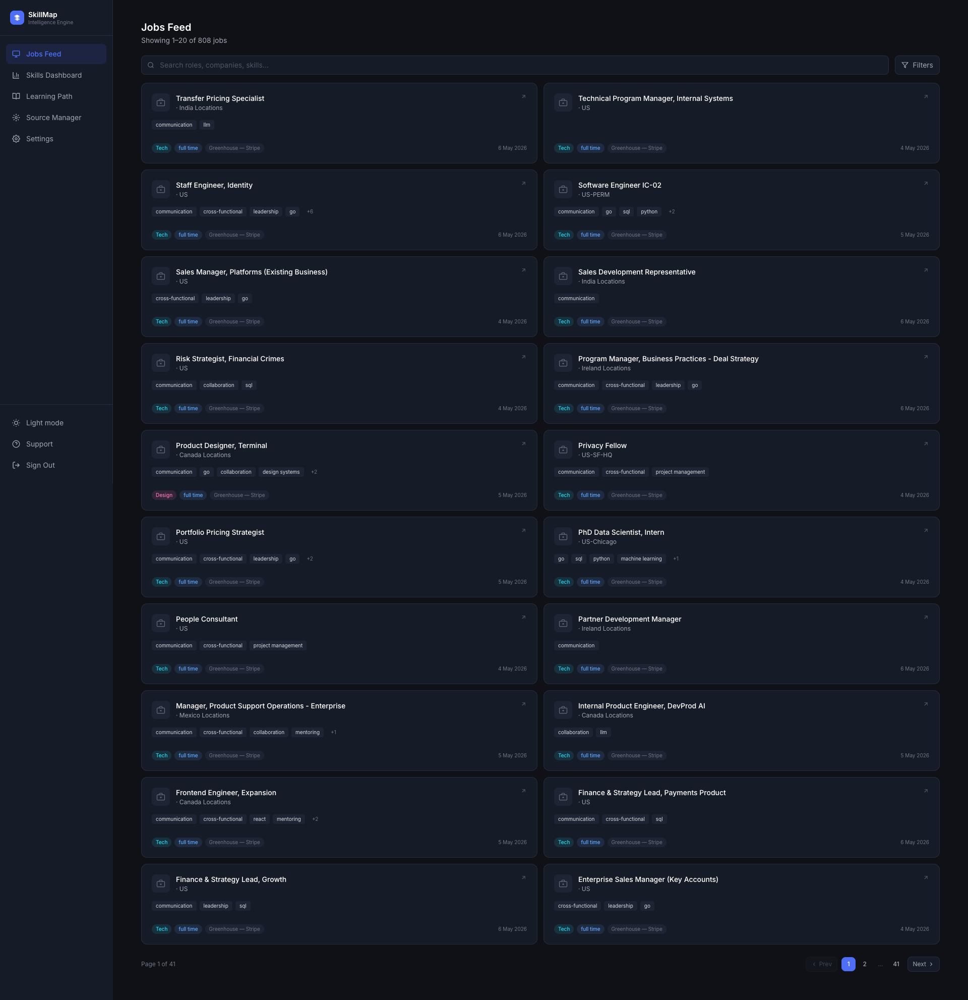
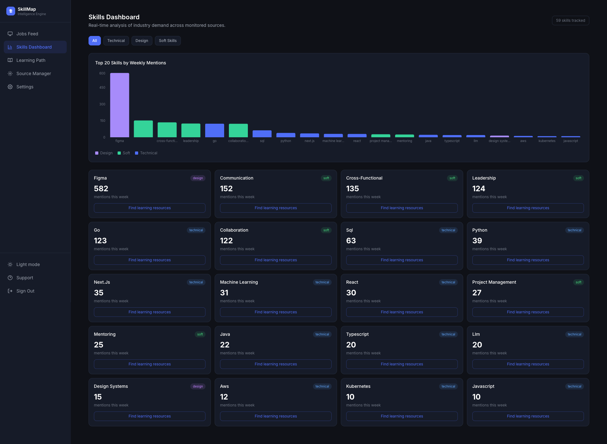
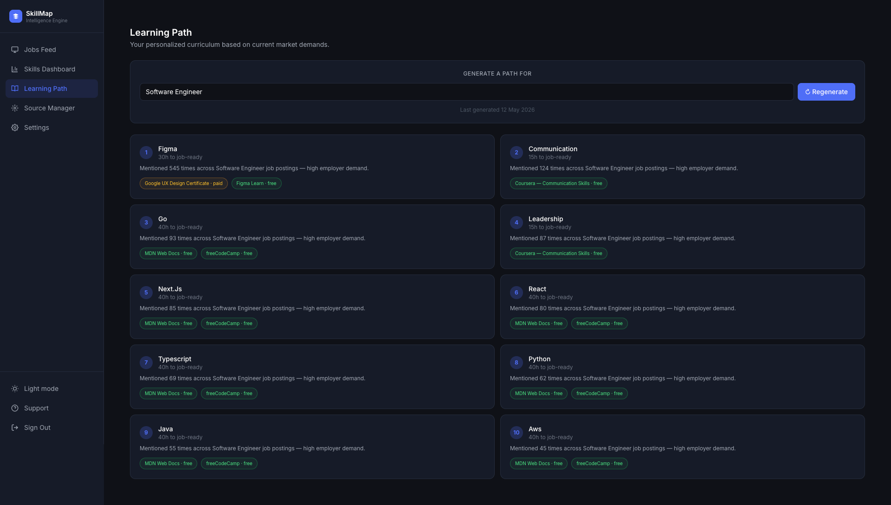

# SkillMap — Know Exactly What to Learn Next

SkillMap is an AI-powered job aggregator and learning recommendation platform built for developers, designers, and UI/UX professionals who want to stay ahead of what the market actually demands.

It scrapes real job listings from multiple sources, uses Claude AI to extract the skills employers are asking for, and generates a personalised learning path based on what you already know and where you want to go.

---

## What It Does

The tech and design job market moves fast. It's hard to know whether to learn TypeScript or GraphQL, Figma auto-layout or Framer, system design or TypeScript generics. SkillMap solves this by grounding your learning decisions in live market data instead of opinion.

**Core capabilities:**

- Aggregates tech, design, and UI/UX job listings from Greenhouse, Remotive, Adzuna, and any custom source you add
- Extracts required skills from every job description using Claude AI (with keyword fallback when no API key is set)
- Shows trending skills by category with a weekly mentions chart
- Generates a personalised learning path ranked by priority, estimated hours, and curated resources
- Verifies job listing URLs daily — inactive listings are automatically hidden from the feed
- Lets you add your own job sources with CSS selector configuration — no code needed

---

## App Pages

### Landing Page



### Jobs Feed (`/jobs`)
The main dashboard. Shows all active scraped job listings with filters for category (Tech / Design / UI/UX) and job type. Each card shows the company, role, location, extracted skills, and a verification badge showing when the listing was last confirmed live.

Use the search bar to find roles by title, company, or keywords in the description.



### Skills Dashboard (`/skills`)
Shows the top 20 skills ranked by weekly mention count across all scraped jobs. Filter by category (Technical, Design, Soft Skills). The bar chart updates as new jobs are scraped and skills are extracted.



### Learning Path (`/learning`)
Your AI-generated curriculum. Claude reads your known skills, your target role, and the top trending skills, then produces a ranked list of what to learn next — with a reason why employers want it now, estimated hours to proficiency, and 2–3 specific learning resources per skill.

Hit **Regenerate** at any time to produce a fresh path as market data changes.



### Source Manager (`/sources`)
Manage the job data pipelines feeding SkillMap. Built-in sources (Remotive, Greenhouse boards) are pre-configured. You can:

- Add any job board as a custom source by providing the URL and CSS selectors for job title, company, location, and description
- Trigger a manual scrape with the ▶ button
- Monitor status: Active, Pending, Error, Paused

### Profile & Settings (`/settings`)
Set your current role and target role. These are used by the AI to personalise your learning path.

---

## Architecture

SkillMap is composed of four independently deployable services that communicate over HTTP and a shared Redis message broker.

```
┌─────────────────────────────────────────────────────────────────┐
│                          User Browser                           │
└────────────────────────────┬────────────────────────────────────┘
                             │ HTTPS
                             ▼
┌─────────────────────────────────────────────────────────────────┐
│                    React Frontend (Vite)                        │
│  Jobs Feed · Skills Dashboard · Learning Path · Source Manager  │
└────────────────────────────┬────────────────────────────────────┘
                             │ REST (JWT)
                             ▼
┌─────────────────────────────────────────────────────────────────┐
│                     Django API (gunicorn)                       │
│                                                                 │
│  /api/jobs/        /api/skills/       /api/recommendations/     │
│  /api/sources/     /api/auth/         /api/internal/            │
└──────┬──────────────────┬──────────────────────┬───────────────┘
       │ ORM              │ shared_task.delay()   │ X-Internal-Key
       ▼                  ▼                       ▼
┌────────────┐   ┌─────────────────┐   ┌─────────────────────────┐
│ PostgreSQL │   │      Redis      │   │    Flask Scraper API     │
│            │   │  (task broker)  │   │  POST /scrape            │
│  jobs      │   └────────┬────────┘   │  GET  /scrape/status/:id │
│  skills    │            │            └───────────┬─────────────┘
│  sources   │     ┌──────┴──────┐                │
│  users     │     │             │                 │
└────────────┘     ▼             ▼                 ▼
            ┌──────────┐  ┌───────────┐  ┌──────────────────┐
            │  Django  │  │  Scraper  │  │  Celery Beat     │
            │  Celery  │  │  Celery   │  │  (scheduler)     │
            │  Worker  │  │  Worker   │  │                  │
            │          │  │           │  │  every 6h:       │
            │ extract  │  │ scrape_   │  │  scrape_all_     │
            │ _and_    │  │ source    │  │  sources         │
            │ save_    │  │           │  │                  │
            │ skills   │  │ verify_   │  │  daily 02:00:    │
            └──────────┘  │ active_   │  │  verify_active_  │
                          │ jobs      │  │  jobs            │
                          └───────────┘  └──────────────────┘
```

### Request flow (user-facing)

```
Browser → React → GET /api/jobs/          → Django → PostgreSQL → JSON response
Browser → React → GET /api/skills/        → Django → PostgreSQL → JSON response
Browser → React → GET /api/recommendations/ → Django → Anthropic Claude → stored + returned
```

### Background pipeline (automated)

```
Celery Beat (every 6h)
  └─▶ scrape_all_sources
        └─▶ scrape_source (per source, via Scraper Celery Worker)
              └─▶ Flask scraper fetches jobs (Greenhouse / Remotive / Adzuna / HTML)
                    └─▶ POST /api/internal/ingest/ → Django saves new Job rows
                          └─▶ extract_and_save_skills (Django Celery Worker)
                                └─▶ Claude API (or keyword fallback)
                                      └─▶ Skill + JobSkill rows saved

Celery Beat (daily 02:00 UTC)
  └─▶ verify_active_jobs (Scraper Celery Worker)
        └─▶ GET /api/internal/jobs/active/ → stale job URLs
              └─▶ HEAD request per URL
                    └─▶ POST /api/internal/jobs/verify/
                          ├─▶ live URLs  → last_verified_at = now
                          └─▶ dead URLs  → is_active = False (hidden from feed)
```

### Service responsibilities

| Service | Responsibility |
|---|---|
| **Django API** | Auth, data access, AI calls, ingest & verification endpoints |
| **Django Celery Worker** | Skill extraction from job descriptions (Claude / keyword) |
| **Flask Scraper** | HTTP interface for triggering scrapes on demand |
| **Scraper Celery Worker** | Fetches raw job data from external sources; runs verification |
| **Celery Beat** | Schedules periodic scrapes (6h) and verification (daily) |
| **PostgreSQL** | Persistent storage for all domain data |
| **Redis** | Celery task broker and result backend |

---

## Tech Stack

| Layer | Technology |
|---|---|
| Frontend | React 18, Vite, TypeScript, Tailwind CSS, Recharts |
| Data fetching | TanStack React Query, Axios |
| Main backend | Django 4.2, Django REST Framework |
| Auth | JWT (djangorestframework-simplejwt) |
| Scraping service | Flask 3, Celery 5 |
| Task queue | Celery + Redis |
| HTML scraping | BeautifulSoup4 |
| AI extraction | Anthropic Claude (`claude-3-5-sonnet-20241022`) |
| Database | PostgreSQL 15 |
| Cache / broker | Redis 7 |
| Containerisation | Docker + Docker Compose |

---

## Project Structure

```
skillmap/
├── docker-compose.yml
├── .env.example
├── backend/                  ← Django API + Celery worker
│   ├── config/               ← Settings, URLs, WSGI, Celery app
│   └── apps/
│       ├── users/            ← Auth, profiles, skill preferences
│       ├── jobs/             ← Job listings, filtering, skill extraction, verification
│       ├── skills/           ← Skill model, trend tracking
│       ├── sources/          ← Job source config + seed command
│       └── recommendations/  ← Learning path generation
├── scraper/                  ← Flask microservice
│   ├── app.py                ← /scrape and /scrape/status endpoints
│   ├── tasks.py              ← Celery tasks + beat schedule
│   └── scrapers/
│       ├── base.py           ← Abstract base scraper
│       ├── remotive.py       ← Remotive public API
│       ├── adzuna.py         ← Adzuna Jobs API
│       ├── greenhouse.py     ← Greenhouse company boards
│       └── custom.py         ← CSS-selector based scraper
├── extension/                ← Chrome extension (import jobs from career sites)
└── frontend/                 ← React app
    ├── public/               ← Static assets (favicon)
    └── src/
        ├── api/              ← Axios instance + API functions
        ├── pages/            ← All page components
        ├── components/       ← Layout, sidebar, shared UI
        └── store/            ← Auth state
```

---

## Chrome extension

Import jobs from LinkedIn, Indeed, Greenhouse, and other career pages while you browse. See **[extension/README.md](extension/README.md)** for setup:

1. `cd extension && npm install && npm run build`
2. Chrome → `chrome://extensions` → **Load unpacked** → select the `extension/` folder
3. Extension options → sign in with your SkillMap account
4. Open a job posting → extension popup → **Import to SkillMap**

Uses `POST /api/jobs/import/` with your JWT (same auth as the web app).

---

## Setup & Running

### Prerequisites
- [Docker Desktop](https://www.docker.com/products/docker-desktop/) — handles everything else

### 1. Configure environment

```bash
cp .env.example .env
```

Open `.env` and fill in:

```bash
DJANGO_SECRET_KEY=any-long-random-string
ANTHROPIC_API_KEY=sk-ant-...         # from console.anthropic.com (optional — keyword fallback runs without it)
ADZUNA_APP_ID=                        # optional
ADZUNA_API_KEY=                       # optional
```

### 2. Start all services

```bash
docker compose up
```

First run takes ~3–5 minutes to download images and install packages. Subsequent starts are instant.

### 3. Run migrations (first time only)

In a second terminal tab while Docker is running:

```bash
docker compose exec backend python manage.py migrate
```

### 4. Seed built-in sources and trigger first scrape

```bash
docker compose exec backend python manage.py seed_sources --scrape
```

This creates the built-in Remotive and Greenhouse sources and immediately queues a scrape for each. Jobs will start appearing in the feed within 1–2 minutes. Skills will be extracted in the background by the `django-celery` worker.

### 5. Create an admin account (optional)

```bash
docker compose exec backend python manage.py createsuperuser
```

Access the Django admin at `http://localhost:8000/admin/`.

---

## Where Things Run

| Service | URL |
|---|---|
| React frontend | http://localhost:5173 |
| Django API | http://localhost:8000/api/ |
| Django admin | http://localhost:8000/admin/ |
| Flask scraper | http://localhost:5001/health |

---

## Daily Workflow

```bash
# Start
docker compose up

# Stop
docker compose down

# Watch logs for a specific service
docker compose logs -f backend
docker compose logs -f django-celery
docker compose logs -f celery

# Re-run migrations after model changes
docker compose exec backend python manage.py makemigrations
docker compose exec backend python manage.py migrate
```

---

## How the Scraping Pipeline Works

```
Celery Beat (every 6h)
    ↓
scrape_all_sources task
    ↓
For each active Source → scrape_source task
    ↓
Flask scraper fetches raw jobs (API or HTML)
    ↓
Normalised job dicts POSTed to Django /api/internal/ingest/
    ↓
Django saves new Job rows (is_active=True, last_verified_at=now), skips duplicates by URL
    ↓
extract_and_save_skills Celery task queued per new job (django-celery worker)
    ↓
Claude API (or keyword fallback) extracts skills from job description
    ↓
Skill rows created/updated, JobSkill rows saved, weekly_mentions incremented
```

## How Job Verification Works

```
Celery Beat (daily 02:00 UTC)
    ↓
verify_active_jobs task
    ↓
Fetches active jobs not verified in the last 7 days from Django
    ↓
HEAD request to each job URL (0.3s delay between requests)
    ↓
404 / connection error → marked is_active=False (hidden from feed)
Live URL → last_verified_at stamped with current time
    ↓
Results POSTed to Django /api/internal/jobs/verify/
```

---

## Adding a Custom Job Source

1. Go to **Source Manager** in the app
2. Click **Add Source**
3. Fill in the job board URL
4. Set Ingestion Type to **Web Scrape**
5. Provide CSS selectors as JSON:

```json
{
  "job_container": ".job-listing",
  "title": "h2.job-title",
  "company": ".company-name",
  "location": ".location",
  "description": ".job-description",
  "url": "a.apply-link[href]"
}
```

The `[href]` suffix on the URL selector tells the scraper to extract the attribute value rather than text content. The `next_page` key is optional — add it to follow pagination automatically.

6. Set frequency and click **Add Source**
7. Hit **▶** to trigger an immediate scrape and verify it works

---

## API Reference

All endpoints require `Authorization: Bearer <access_token>` unless noted.

### Auth
| Method | Endpoint | Description |
|---|---|---|
| POST | `/api/auth/register/` | Create account, returns JWT pair |
| POST | `/api/auth/login/` | Login, returns JWT pair |
| POST | `/api/auth/refresh/` | Refresh access token |
| POST | `/api/auth/logout/` | Blacklist refresh token |
| GET/PATCH | `/api/auth/me/` | Get or update profile |

### Jobs
| Method | Endpoint | Description |
|---|---|---|
| GET | `/api/jobs/` | Paginated list of active jobs. Params: `search`, `category`, `job_type`, `location`, `source`, `skills`, `ordering` |
| GET | `/api/jobs/{id}/` | Full job detail with extracted skills |
| GET | `/api/jobs/trending/` | Most recently scraped active jobs |

### Skills
| Method | Endpoint | Description |
|---|---|---|
| GET | `/api/skills/` | All skills sorted by weekly mentions. Param: `category` |
| GET | `/api/skills/trending/` | Top 20 skills by weekly mentions |
| GET | `/api/skills/{id}/` | Skill detail |

### Sources
| Method | Endpoint | Description |
|---|---|---|
| GET | `/api/sources/` | All active sources (built-in + yours) |
| POST | `/api/sources/` | Add a custom source |
| PATCH/DELETE | `/api/sources/{id}/` | Update or remove (owner only) |
| POST | `/api/sources/{id}/trigger/` | Manually trigger a scrape |

### Recommendations
| Method | Endpoint | Description |
|---|---|---|
| GET | `/api/recommendations/` | Get learning path (generates if none exists) |
| POST | `/api/recommendations/regenerate/` | Force a fresh Claude API call |

### Internal (scraper → Django, protected by `X-Internal-Key`)
| Method | Endpoint | Description |
|---|---|---|
| POST | `/api/internal/ingest/` | Bulk ingest scraped job dicts |
| GET | `/api/internal/jobs/active/` | Fetch active jobs due for re-verification. Param: `stale_days` (default 7) |
| POST | `/api/internal/jobs/verify/` | Submit verification results `{"verified": [...urls], "inactive": [...urls]}` |

---

## Environment Variables

| Variable | Required | Description |
|---|---|---|
| `DJANGO_SECRET_KEY` | Yes | Django secret key |
| `DJANGO_DEBUG` | Yes | `True` for local, `False` for production |
| `DJANGO_ALLOWED_HOSTS` | Yes | Comma-separated allowed hostnames |
| `DATABASE_URL` | Auto | PostgreSQL connection string (set by Docker) |
| `REDIS_URL` | Auto | Redis connection string (set by Docker) |
| `INTERNAL_API_KEY` | Yes | Shared secret between Django and Flask scraper |
| `ANTHROPIC_API_KEY` | Optional | Claude API key — keyword extraction runs as fallback without it |
| `ADZUNA_APP_ID` | Optional | Adzuna Jobs API ID |
| `ADZUNA_API_KEY` | Optional | Adzuna Jobs API key |
| `CORS_ALLOWED_ORIGINS` | Production | Comma-separated frontend URLs (e.g. Vercel domain) |
| `JWT_ACCESS_TOKEN_LIFETIME` | Optional | Access token lifetime in minutes (default: 60) |
| `JWT_REFRESH_TOKEN_LIFETIME` | Optional | Refresh token lifetime in days (default: 7) |
| `VITE_API_BASE_URL` | Frontend | Backend API base URL (e.g. `http://localhost:8000`) |

---

## Deployment

### Backend → Railway

Deploy each service from the corresponding subfolder:

| Railway service | Root directory | Start command override |
|---|---|---|
| `backend` | `backend` | *(uses Dockerfile CMD — gunicorn)* |
| `django-celery` | `backend` | `celery -A config.celery worker --loglevel=info` |
| `scraper` | `scraper` | *(uses Dockerfile CMD)* |
| `celery` | `scraper` | `celery -A tasks worker --loglevel=info` |
| `celery-beat` | `scraper` | `celery -A tasks beat --loglevel=info` |

Add a **PostgreSQL** and **Redis** plugin via Railway's dashboard. Railway injects `DATABASE_URL` and `REDIS_URL` automatically.

Set all env vars from the table above in Railway's shared environment. Update `DJANGO_ALLOWED_HOSTS` to your Railway backend domain and `CORS_ALLOWED_ORIGINS` to your Vercel frontend domain.

### Frontend → Vercel

Connect the repo on [vercel.com](https://vercel.com), set root directory to `frontend/`, and add:

```
VITE_API_BASE_URL=https://your-backend.up.railway.app
```

Vercel auto-detects Vite and runs `npm run build`.

---

## Roadmap

- [x] Phase 1 — Project scaffold, auth, Docker setup
- [x] Phase 2 — Full scraping pipeline (Greenhouse, Remotive, Adzuna, custom HTML)
- [x] Phase 3 — Skill extraction (Claude AI + keyword fallback) + trend tracking
- [x] Phase 4 — Learning path generation with Claude
- [x] Phase 5 — Full frontend with charts, filters, and pagination
- [x] Phase 6 — Job verification pipeline (daily URL checks, is_active filtering)
- [ ] Phase 7 — Production deploy (Railway + Vercel)
